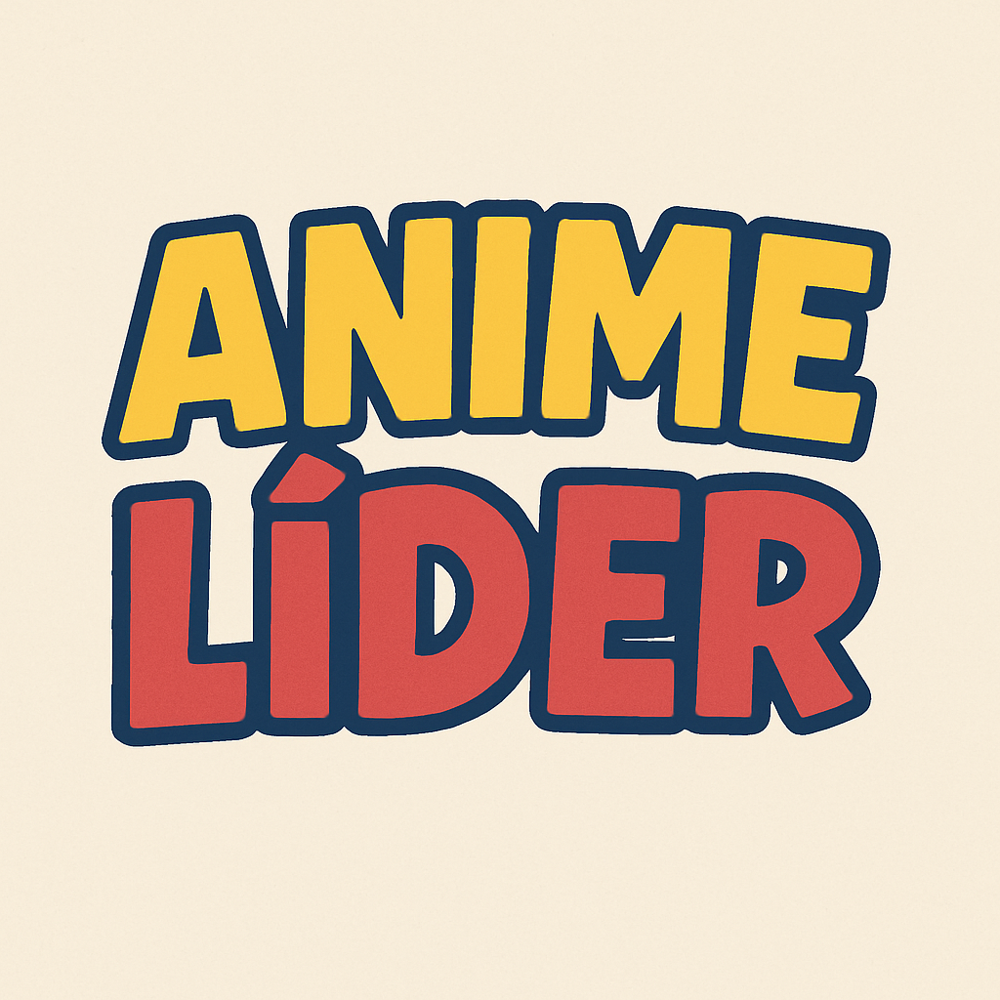

# Anime Líder - Anime Leadership Quiz 🎌✨



Discover your anime leadership style with this interactive quiz! Answer questions to find out which anime character matches your leadership type, complete with descriptions and shareable results.

## Features 🌟

-   **Anime-themed leadership assessment** - 10+ personality questions
-   **Beautiful UI** - Gradient backgrounds & smooth animations
-   **Character matching** - Get matched with iconic anime characters
-   **Shareable results** - Copy or share via WhatsApp
-   **Mobile-friendly** - Responsive Tailwind CSS design
-   **Interactive buttons** - Framer Motion animations

## Technologies Used 🛠️

-   React + TypeScript + Vite
-   Tailwind CSS (with gradient backgrounds)
-   Framer Motion (for animations)

## Installation & Setup 🚀

### Prerequisites

-   Node.js (v16+ recommended)
-   npm/yarn/pnpm

### 1. Clone the repository

```bash
git clone https://github.com/LeonardoZanotti/KetsudanQuest.git
cd KetsudanQuest
```

### 2. Install dependencies

```bash
npm install
# or
yarn install
# or
pnpm install
```

### 3. Run the development server

```bash
npm run dev
# or
yarn dev
# or
pnpm dev
```

The app will open at <http://localhost:5173>

### 4. Build for production

```bash
npm run build
# or
yarn build
# or
pnpm build
```

### Project Structure 📁

```text
KetsudanQuest/
├── src/
│   ├── assets/            # Images and logos
│   ├── data.ts            # Questions and leadership types data
│   ├── App.tsx            # Main application component
│   └── App.css            # Additional CSS styles
├── public/
├── index.html
├── vite.config.js
└── package.json
```

### Data Structure (Customization Guide) 📝

Edit src/data.ts to modify:

-   Questions and options
-   Leadership type definitions
-   Anime character matches
-   Result descriptions

Example data structure:

```ts
export const questions: Question[] = [
	{
		id: 1,
		question: "When your team faces a problem...",
		options: [
			{ id: 1, text: "Take charge immediately", type: "shonen" },
			{ id: 2, text: "Analyze carefully first", type: "strategist" },
		],
	},
	// ...more questions
];

export const leadershipTypes: Record<string, LeadershipType> = {
	shonen: {
		type: "Shonen Hero",
		description: "You charge ahead with determination!",
		anime: {
			name: "Naruto Uzumaki",
			img: "/naruto.png",
		},
	},
	// ...more types
};
```

### Deployment 📦

**Vercel (Recommended)**

-   Push to GitHub/GitLab
-   Import project at vercel.com
-   Configure as Vite/React project

**Netlify**

-   Push to GitHub
-   New site from Git → Select repo
-   Build command: npm run build
-   Publish directory: dist

### Customization 🎨

**Change colors**: Modify the gradient classes in App.tsx:

```jsx
bg-gradient-to-br from-purple-700 via-pink-600 to-red-600
```

Add animations: Edit Framer Motion props like:

```jsx
<motion.div
initial={{ opacity: 0 }}
animate={{ opacity: 1 }}
transition={{ duration: 0.5 }}
```

### Leadership types

The full list of leadership types is as follows:

-   Transformacional: Líderes transformacionais inspiram e motivam por meio da visão, carisma e paixão.Eles desafiam o status quo, promovem mudanças positivas e acreditam no potencial das pessoas.
-   Transacional: Focados em metas e recompensas. Lideram com base em desempenho, regras claras e estrutura. São excelentes para manter a ordem e a eficiência.
-   Servidor: Colocam as necessidades da equipe em primeiro lugar. Valorizam empatia, escuta ativa e apoio emocional, criando ambientes seguros e colaborativos.
-   Autocrático: Tomam decisões unilaterais, exigem obediência e mantêm controle absoluto. São eficientes em crises, mas podem suprimir a criatividade.
-   Democrático: Promovem participação e valorizam o consenso. Buscam soluções coletivas, incentivando o pensamento crítico e o engajamento de todos.
-   Liberal: Oferecem liberdade total para a equipe. Confiam na autonomia e criatividade, intervindo apenas quando necessário.
-   Carismático: Lideram pelo magnetismo pessoal. Inspiram entusiasmo, devoção e lealdade através da presença marcante e comunicação persuasiva.
-   Visionário: Guiados por uma visão de futuro clara, mobilizam a equipe para um propósito maior. São estratégicos, intuitivos e inspiradores.
-   Motivacional: Focados no desenvolvimento individual. Ajudam a equipe a crescer, aprendendo com os erros e ampliando o potencial de cada membro.
-   Situacional: Adaptam seu estilo conforme o contexto e as pessoas envolvidas. Flexíveis, sabem quando liderar, delegar, motivar ou controlar.

Also the animes characters per leadership type are:

-   Transformacional

    -   **Descrição**: Inspira e motiva por meio da visão, carisma e paixão. Desafia o status quo e promove mudanças positivas.
    -   **Personagem Masculino**: Naruto Uzumaki (Naruto)
    -   **Personagem Feminino**: Sailor Moon (Sailor Moon)

-   Transacional

    -   **Descrição**: Focado em metas e recompensas. Lidera com base em desempenho, regras claras e estrutura.
    -   **Personagem Masculino**: Light Yagami (Death Note)
    -   **Personagem Feminino**: Olivier Armstrong (Fullmetal Alchemist)

-   Servidor

    -   **Descrição**: Coloca as necessidades da equipe em primeiro lugar. Valoriza empatia e apoio emocional.
    -   **Personagem Masculino**: Tanjiro Kamado (Demon Slayer)
    -   **Personagem Feminino**: Tohru Honda (Fruits Basket)

-   Autocrático

    -   **Descrição**: Toma decisões unilaterais e mantém controle absoluto. Eficiente em crises.
    -   **Personagem Masculino**: Madara Uchiha (Naruto)
    -   **Personagem Feminino**: Big Mom (One Piece)

-   Democrático

    -   **Descrição**: Promove participação e consenso. Busca soluções coletivas e engajamento.
    -   **Personagem Masculino**: Edward Elric (Fullmetal Alchemist)
    -   **Personagem Feminino**: Emma (The Promised Neverland)

-   Liberal

    -   **Descrição**: Oferece liberdade total à equipe. Intervém apenas quando necessário.
    -   **Personagem Masculino**: Rimuru Tempest (That Time I Got Reincarnated as a Slime)
    -   **Personagem Feminino**: Tsunade (Naruto)

-   Carismático

    -   **Descrição**: Lidera pelo magnetismo pessoal. Inspira entusiasmo e lealdade.
    -   **Personagem Masculino**: Monkey D. Luffy (One Piece)
    -   **Personagem Feminino**: Erza Scarlet (Fairy Tail)

-   Visionário

    -   **Descrição**: Guiado por visão de futuro clara. Mobiliza a equipe para um propósito maior.
    -   **Personagem Masculino**: Erwin Smith (Attack on Titan)
    -   **Personagem Feminino**: Hange Zoe (Attack on Titan)

-   Motivacional

    -   **Descrição**: Focado no desenvolvimento individual. Ajuda a equipe a crescer com os erros.
    -   **Personagem Masculino**: Kakashi Hatake (Naruto)
    -   **Personagem Feminino**: Rukia Kuchiki (Bleach)

-   Situacional
    -   **Descrição**: Adapta o estilo conforme o contexto. Flexível em diferentes situações.
    -   **Personagem Masculino**: Gon Freecss (Hunter X Hunter)
    -   **Personagem Feminino**: Frieren (Frieren: Beyond Journey’s End)

### Visual Identity

#### Paleta de Cores

A identidade visual segue o esquema de cores da marca "Encontro Jovem Nikkei do Sul do Brasil":

-   **Azul Principal** `#2152a0`

    _Utilização_: Fundo principal, textos e elementos de destaque

    _Representa_: Confiança, estabilidade e tradição

-   **Rosa Vibrante** `#ed6ea7`

    _Utilização_: Botões principais, elementos interativos e divisores

    _Representa_: Energia, juventude e conexão

-   **Laranja-Amarelo** `#f8b12a`

    _Utilização_: Botões de opção, destaques de texto e fundos secundários

    _Representa_: Otimismo, criatividade e ação

-   **Verde Fresco** `#2be28a`

    _Utilização_: Bordas, elementos decorativos e realces

    _Representa_: Crescimento, renovação e natureza

#### Tipografia

-   **Fonte Primária: Poppins**

    -   Família completa (9 pesos + itálicos)

    -   Utilizada em todos os textos do aplicativo

    -   Características: Moderna, legível e com excelente suporte a acentuação

-   **Hierarquia Tipográfica:**

    -   Títulos: Poppins Bold/ExtraBold (36-48px)

    -   Subtítulos: Poppins SemiBold (24-32px)

    -   Corpo de Texto: Poppins Regular/Medium (16-20px)

    -   Botões: Poppins SemiBold (18px)

#### Elementos Visuais

1. Padrão de Sakura (Cerejeira):

    - Fundo sutil com padrão SVG de pétalas

    - Cor: Rosa #ed6ea7 com 20% de opacidade

    - Simbolismo: Representa a herança cultural japonesa

2. Elemento Pinhão:

    - Ícone decorativo SVG na tela inicial

    - Cor: Verde #2be28a com 20% de opacidade

    - Simbolismo: Representa a cultura do sul do Brasil

3. Cartões e Containers:

    - Fundo branco com 90% de opacidade

    - Bordas arredondadas (12px)

    - Sombra suave para profundidade

    - Espaçamento generoso entre elementos

#### Tratamento de Imagens

-   **Personagens de Anime:**

    -   Formato: Quadrado (192x192px)

    -   Estilo: Bordas arredondadas (12px) com contorno azul #2152a0

    -   Efeito: Sombra suave para destaque

    -   Legenda: Tag com fundo azul e texto branco

-   **Padronização:**

    -   Todas as imagens seguem proporção 1:1

    -   Objeto-cover para manter aspect ratio

    -   Nomes centralizados com limite de 200px de largura

#### Animação e Interação

-   **Biblioteca:** Framer Motion

-   **Transições:**

    -   Entrada de elementos: Fade-in + deslizamento vertical

    -   Botões: Efeito de escala no hover (1.05x) e clique (0.95x)

    -   Troca de telas: Transições suaves (300ms)

-   **Feedback Visual:**

    -   Botões com mudança de opacidade ao interagir

    -   Indicador de progresso das perguntas

    -   Microinterações em todas ações do usuário

#### Layout Responsivo

-   **Mobile-First:**

    -   Conteúdo em coluna única

    -   Espaçamento vertical generoso

    -   Elementos de divisão horizontal

-   **Desktop:**

    -   Adaptação para telas maiores

    -   Elementos dispostos em linha

    -   Divisores verticais entre seções

    -   Largura máxima de conteúdo (1200px)

#### Componentes-Chave

-   **Tela Inicial:**

    -   Fundo azul com padrão sakura

    -   Elemento pinhão decorativo

    -   Botão com destaque rosa

-   **Perguntas:**

    -   Cartão branco semi-transparente

    -   Opções com fundo laranja-amarelo

    -   Indicador de progresso inferior

-   **Resultados:**

    -   Display lado-a-lado de personagens

    -   Divisor rosa responsivo (horizontal/vertical)

    -   Área de descrição com fundo amarelo suave

    -   Botões de ação com ícones

#### Princípios de Design

-   **Fusão Cultural**: Combina elementos japoneses (sakura, anime) com símbolos brasileiros (pinhão)

-   **Juventude**: Cores vibrantes e tipografia moderna

-   **Acessibilidade**: Contraste adequado e tamanhos de texto legíveis

-   **Consistência**: Padrões visuais aplicados uniformemente

-   **Engajamento**: Animações sutis para melhor experiência

Este sistema de design cria uma identidade visual coesa que honra a herança cultural nikkei enquanto oferece uma experiência moderna e engajante para o público jovem. A paleta vibrante e os elementos temáticos reforçam a proposta do evento enquanto mantêm a usabilidade no centro da experiência.

### Contributing 🤝

1. Fork the project
2. Create your feature branch (git checkout -b feature/AmazingFeature)
3. Commit your changes (git commit -m 'Add some amazing feature')
4. Push to the branch (git push origin feature/AmazingFeature)
5. Open a Pull Request
